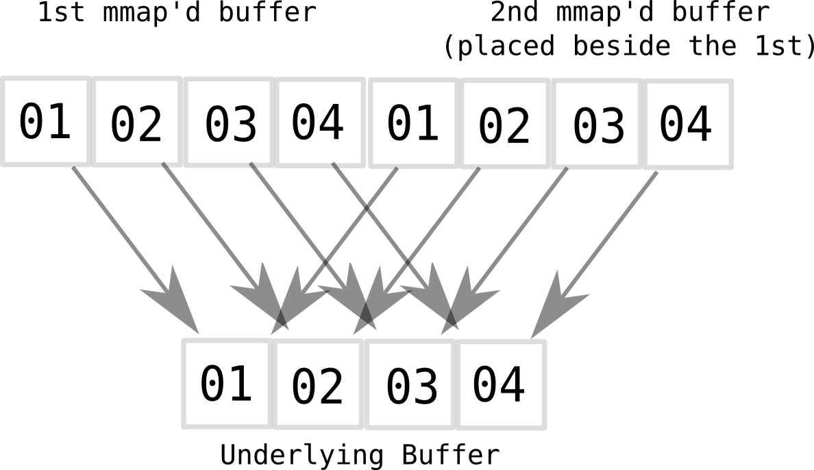
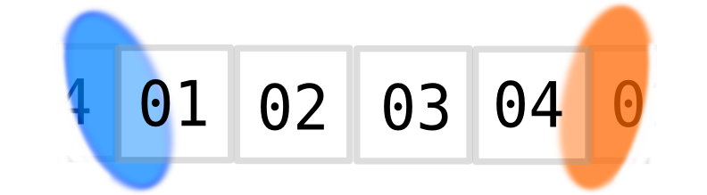

Circular buffer's are tricky because the caller needs to know if the polled item crosses the maximum size of the underlying array.

This circular buffer uses a mmap magic trick to make the caller's life easier.

1. mmap is used to mirror the buffer like below:

2. the "mirrored" buffer is then placed beside the buffer. When the user polls the item it doesn't matter if the item crosses the buffer's boundary:

Compatibility
-------------
This only works on UNIX systems.

Windows support existed in d10238600a82de32fe1cb01bec8667d3a67e382c but was removed. This is because Windows doesn't actually have mmap and trying to get the same behaviour is painful.
